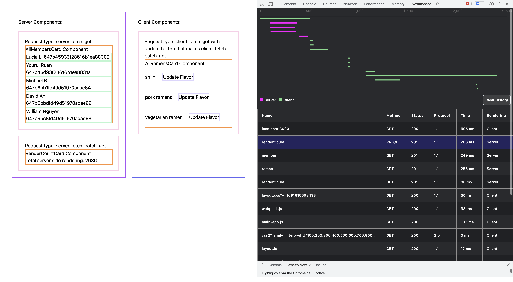

<h1 align="center">NextInspect</h1>

<p align="center">Developer Tool for Viewing Next.js Sever Side Rendered Network Requests</p>

## Table of Contents

1. [Description](#description)
   - [Built With](#built-with)
2. [Getting Started](#getting-started)
   - [Installation](#installation)
   - [Quick Start](#quick-start)
3. [Features](#features)
   - [Waterfall Graph](#waterfall-graph)
   - [Realtime Metrics](#realtime-metrics)
4. [Roadmap](#roadmap)
5. [Contributions](#contributions)
6. [Maintainers](#maintainers)
7. [Changelog](#changelog)
8. [License](#license)

## **Description**

NextInspect is a developer tool that allows Next.js developers to see network request metrics in Server Side Rendered(SSR) components. Metrics are displayed in a format similar to the native Chrome network devtools, so onboarding and usage is a breeze. Metrics for network requests made in Client Side Rendered components are also shown, eliminating the need to click back and forth between the native Chrome devtools and NextInspect. Please also install the Chrome extension for NextInspect to see metrics in the devtools panel.

### Built With

- [OpenTelemetry](https://opentelemetry.io/)
- [TypeScript](https://www.typescriptlang.org/)
- [Express](https://expressjs.com/)
- [React](https://reactjs.org/)
- [Chart.js](https://www.chartjs.org/docs/latest/)
- [Jest](https://jestjs.io/)
- [SuperTest](https://www.npmjs.com/package/supertest)

## Getting Started

### Installation

Installation is done using the `npm install` command.

```console
$ npm install nextinspect
```

In the package.json of your next.js app, add this to the scripts

```
"nextinspect": "node ./node_modules/nextinspect/dist/server.js & node ./node_modules/.bin/next dev"
```

In the 'next.config.js' file of your Next.js app, add a key to your 'nextConfig' object called experimental. The value of this key should be an object and add the following key to this inner object 

```
instrumentationHook: True
```

Add a file to the root directory of your Next.js project called 'instrumentation.js' and paste in the following code

```
export async function register() {
    if (process.env.NEXT_RUNTIME === 'nodejs') {
         await import('nextinspect/tracing'); 
        } 
    }
```


### Quick Start

1. Install the NextInspect Chrome extension [here](https://chrome.google.com/webstore/detail/nextinspect/pnllkkbkkjkhebaeocnbfdcchnpfbbaa)
2. Start both the telemetry collection and your Next.js app in dev mode by running 
```
$ npm run nextinspect
```
3. Go to your Next.js application page.
4. Open the NextInspect devtool by right clicking the page and selecting inspect. In the double right arrow dropdown to the right of the Network tab, you will be able to view your other devtool extensions.
5. Refresh your page to view telemetry metrics.

## Features

### Waterfall Graph

NextInspect provides a waterfall chart showing all network requests made in both client-side and server-side rendered components. Requests originating from server-side rendered components are shown in pink/purple, while client-side rendered requests are in green. The time on the X-axis is measured in milliseconds.

### Realtime Metrics

Network metrics are served in realtime and NextInspect supports additional requests streamed in after the initial page load. Sequential page loads will be added to the same chart. To view requests from individual page loads, simply click the "Clear History" button before navigating to a new page.



## Roadmap

Here are some features our team is looking to bring to NextInspect in the near future:

- Filtering options for chart columns to filter requests by name, method, rendering, etc.
- Ability to export chart metrics to a HAR file.

If you have any suggestions or find any bugs, please feel free to open an issue.

## Contributions

Our team welcomes and encourages new contributions. Any changes to the product resources such as documentation, code, etc should be made through pull requests. All pull requests will be reviewed before merging.

## Changelog

### [1.0.1] - Aug 9, 2023

#### Launched

## Maintainers

- Yourui Ruan | [GitHub](https://github.com/YouruiR) | [Linkedin](https://www.linkedin.com/in/YouruiR/)
- Lucia Li | [GitHub](https://github.com/li-lucia) | [Linkedin](https://www.linkedin.com/in/li-lucia-j)
- Michael Bildstein | [GitHub](https://github.com/mbildstein) | [Linkedin](https://www.linkedin.com/in/mbildstein/)
- William Nguyen | [GitHub](https://github.com/wnguye03) | [Linkedin](https://www.linkedin.com/in/william-nguyen202103/)
- David An | [GitHub](https://github.com/davidan1989) | [Linkedin](https://www.linkedin.com/in/david-an-63b44317/)

## License

This product is licensed under the MIT License without restriction.